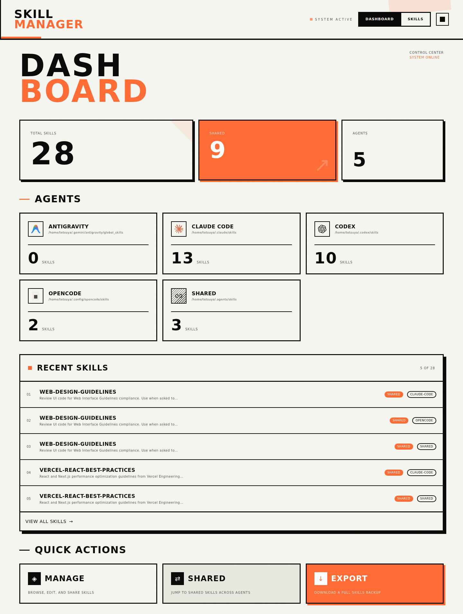

# Skill Manager
ローカルのエージェントスキルを一括管理するためのコントロールセンター。

[English](README.md)



## できること
- 複数エージェントと共有スキルをまとめて一覧化
- 検索・絞り込み・メタデータ確認
- マークダウン表示（コードハイライト対応）
- スキルをシンボリックリンクで共有
- フィルタ済みスキルを ZIP でエクスポート

## クイックスタート
### 必要環境
- Node.js 18+（20+ 推奨）

### インストール
```bash
npm install
```

### 開発
```bash
npm run dev
```

### 本番
```bash
npm run build
npm run start
```

## スキルの判定ルール
各スキルは `SKILL.md` を含むディレクトリ（またはシンボリックリンク）です。
下記のパスをスキャンして UI を構築します。

## 対応エージェント
- Antigravity: `~/.gemini/antigravity/global_skills`
- Claude Code: `~/.claude/skills`
- Cline: `~/.cline/skills`
- Codex: `~/.codex/skills`
- Cursor: `~/.cursor/skills`
- Gemini CLI: `~/.gemini/skills`
- GitHub Copilot: `~/.copilot/skills`
- Goose: `~/.config/goose/skills`
- Kiro CLI: `~/.kiro/skills`
- MCPJam: `~/.mcpjam/skills`
- OpenCode: `~/.config/opencode/skills`
- Pi: `~/.pi/agent/skills`
- Qwen Code: `~/.qwen/skills`
- Trae: `~/.trae/skills`
- Windsurf: `~/.codeium/windsurf/skills`
- 共有: `~/.agents/skills`（シンボリックリンク）

## 補足
- 共有はシンボリックリンクのため、片方の削除が元ファイル削除になるとは限りません。
- ローカルのスキルを読むため、スキルがある同じマシンで起動してください。
